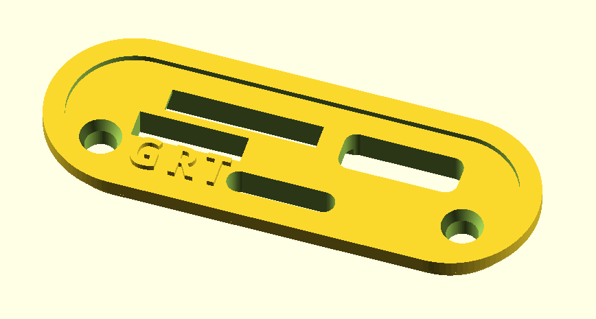
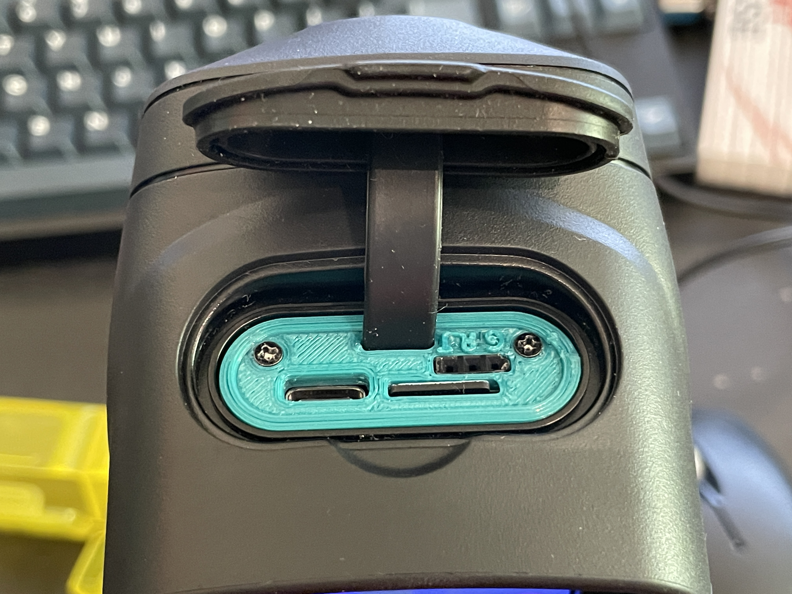

InfiRay C200 serial port cover
==============================

The InfiRay C200 aka "Vevor SC240N" or "TopDon TC004" is a high 
framerate thermal imaging camera with very hackable software. Notably it 
runs Linux and access to bootloader and a root shell is easy to obtain.  

This 3D-printable part allows replacing the factory port 
cover on the top of the device with one providing extra space for a 
female .1 inch header to expose the internal serial port permanently on 
the outside.  

Please note that the serial port is not a 3.3V UART but rather a real RS232 serial port with -6.5V/+6.5V signal levels.  

This work is licensed under the Creative Commons Attribution-ShareAlike 4.0 license.
